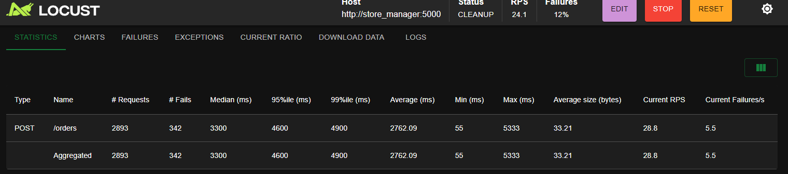
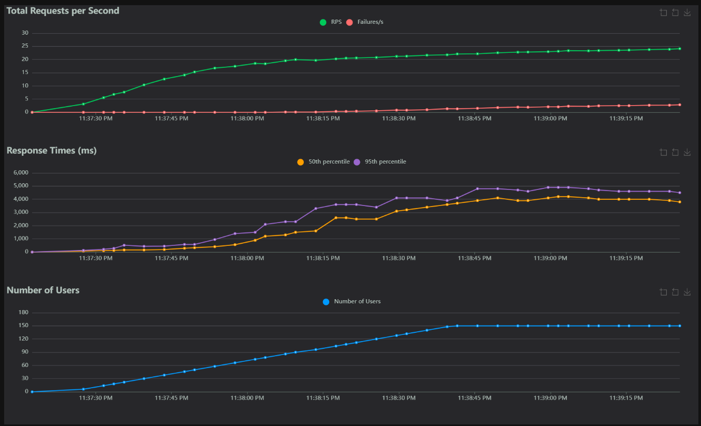
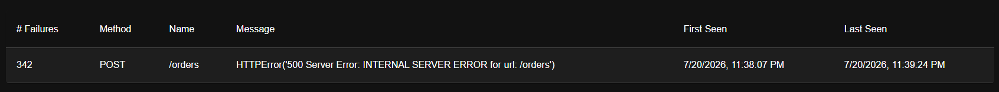

Dyaa Abou Arida

# Rapport Labo 8

**Question 1 : Comment on faisait pour passer d'un état à l'autre dans la saga dans le labo 6, et comment on le fait ici? Est-ce que le contrôle de transition est fait par le même structure dans le code? Illustrez votre réponse avec des captures d'écran ou extraits de code.**

Dans le labo 6, un orchestrateur central contrôlait les états et appelait chaque Handler dans le bon ordre. Dans le labo 8, les transitions se font avec des événements Kafka. Chaque Handler réagit à un événement, effectue son opération, puis publie l’événement suivant. Le contrôle est donc distribué entre les Handlers au lieu d’être dans un seul contrôleur.

Code du labo 6:

    def run(self, request):
            """ Perform steps of order saga """
            payload = request.get_json() or {}
            order_data = {
                "user_id": payload.get('user_id'),
                "items": payload.get('items', [])
            }
            self.create_order_handler = CreateOrderHandler(order_data)

            # Si la saga n'est pas terminée, répétez cette boucle
            while self.current_saga_state is not OrderSagaState.END:
                if self.current_saga_state == OrderSagaState.START:
                    self.logger.debug("État initial")
                    self.current_saga_state = self.create_order_handler.run()
                elif self.current_saga_state == OrderSagaState.ORDER_CREATED:
                    self.decrease_stock_handler = DecreaseStockHandler(self.create_order_handler.order_id, order_data['items'])
                    self.current_saga_state = self.decrease_stock_handler.run()
                elif self.current_saga_state == OrderSagaState.STOCK_DECREASED:
                    self.create_payment_handler = CreatePaymentHandler(self.create_order_handler.order_id, order_data)
                    self.current_saga_state = self.create_payment_handler.run()
                elif self.current_saga_state == OrderSagaState.STOCK_INCREASED:
                    self.delete_order_handler = DeleteOrderHandler(self.create_order_handler.order_id)
                    self.current_saga_state = self.delete_order_handler.run()
                elif self.current_saga_state is OrderSagaState.PAYMENT_CREATED or self.current_saga_state is OrderSagaState.ORDER_DELETED:
                    self.logger.debug("Transition à l'état terminal")
                    self.current_saga_state = OrderSagaState.END
                else:
                    self.is_error_occurred = True
                    self.logger.debug(f"L'état de la commande n'est pas valide : {self.current_saga_state}")
                    self.current_saga_state = OrderSagaState.END

            return {
                "order_id": self.create_order_handler.order_id,
                "status":  "Une erreur s'est produite lors de la création de la commande." if self.is_error_occurred else "OK"
            }

Code du labo 8:

    def _process_message(self, event_data: dict) -> None:
        event_type = event_data.get('event')

        handler = self.registry.get_handler(event_type)

        if handler:
            logger.debug(f"Evenement : {event_type}")
            handler.handle(event_data)

---

**Question 2 : Sur la relation entre nos Handlers et le patron CQRS : pensez-vous qu'ils utilisent plus souvent les Commands ou les Queries? Est-ce qu'on tient l'état des Queries à jour par rapport aux changements d'état causés par les Commands? Illustrez votre réponse avec des captures d'écran ou extraits de code.**

Les Handlers utilisent surtout les Commands, car ils modifient les commandes, les stocks ou les paiements. Les Queries servent plutôt à lire les données. Après une Command, les données de lecture dans Redis sont aussi mises à jour pour rester cohérentes avec MySQL.

Code de write_stock et write_order:

    session.commit()
    add_order_to_redis(order_id, user_id, total_amount, items)

    update_stock_mysql(session, order_items, "-")
    update_stock_redis(order_items, "-")

---

**Question 3 : Est-ce qu'une architecture Saga orchestrée pourrait aussi bénéficier de l'utilisation du patron Outbox, ou c'est un bénéfice exclusif de la saga chorégraphiée? Justifiez votre réponse avec un diagramme ou en faisant des références aux classes, modules et méthodes dans le code.**

Oui, une saga orchestrée peut aussi utiliser le patron Outbox. L’orchestrateur pourrait enregistrer l’opération à faire dans une table Outbox avant d’appeler un autre service, puis reprendre le traitement après un redémarrage. Ce n’est donc pas exclusif à la saga chorégraphiée, c’est surtout un patron pour éviter de perdre une opération en cas de panne.

Code du outbox:

    outbox_items = session.query(Outbox)\
        .filter(Outbox.payment_id.is_(None)).all()

    for outbox_item in outbox_items:
        event_data = self._get_event_data(outbox_item)
        self._process_outbox_item(event_data, outbox_item)

Code du store_manager:

    if not is_outbox_processor_running:
        OutboxProcessor().run()
        is_outbox_processor_running = True

---

**Question 4 : Qu'est-ce qui arriverait si notre application s'arrête avant la création de l'enregistrement dans la table Outbox? Comment on pourrait améliorer notre implémentation pour résoudre ce problème? Justifiez votre réponse avec un diagramme ou en faisant des références aux classes, modules et méthodes dans le code.**

Si l’application s’arrête avant l’écriture dans la table Outbox, la commande reste créée sans paiement et l’opération est perdue. Pour éviter ça, il faudrait créer la commande et l’entrée Outbox dans la même transaction MySQL. Comme ça, soit les deux sont enregistrées, soit aucune des deux ne l’est.

Code du write_order:

    session.commit()
    add_order_to_redis(order_id, user_id, total_amount, items)

Code du stock_decreased_handler:

    new_outbox_item = Outbox(
        order_id=event_data["order_id"],
        user_id=event_data["user_id"],
        total_amount=event_data["total_amount"],
        order_items=event_data["order_items"]
    )

    session.add(new_outbox_item)
    session.commit()

---

## Test de Charge

Avec 150 utilisateurs, le système a traité 2893 requêtes avec environ 11,8 % d’échecs. Le temps de réponse moyen était de 2762 ms et le 95e percentile de 4600 ms. On remarque que les temps de réponse et les erreurs augmentent avec le nombre d’utilisateurs, ce qui montre que l’application commence à être surchargée sous une forte charge.

8.1 Statistiques locust

8.2 Charts locust

8.3 Erreurs locust

